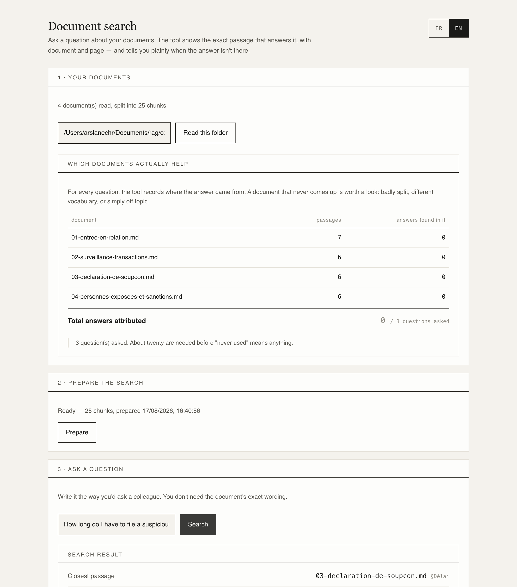
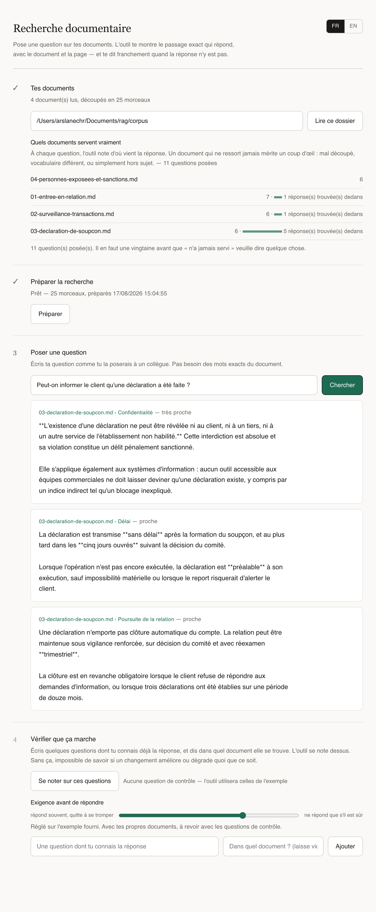

# Document search that knows when to shut up

A retrieval system over a bank compliance manual. It answers by quoting the exact
passage — document, page, section — and **refuses to answer** when the manual doesn't
cover the question.

Everything runs locally: no API key, no external service, nothing leaves the machine.
That constraint is the point. A compliance manual doesn't get shipped to a third party
just to run a demo.

**[Try it in your browser →](https://arslanesempai-ui.github.io/compliance-document-search/)**
— twenty-five questions, six of which the corpus cannot answer. Those are the ones worth
clicking.

> **This repository is a write-up and a demo, not the source.** The engine — the chunker,
> the keyword index, the rank fusion, the PDF reader, the evaluation harness — is private.
> What is published here is the interface, the corpus, and pre-computed vectors for the
> evaluation questions: enough to use the thing, not enough to rebuild it. I'm happy to walk
> through the rest in a conversation.

---

## Why this problem

The corpus is a bank compliance manual: client onboarding, transaction monitoring,
suspicious activity reporting, sanctions screening.

This is the domain where **making something up is not an option**. A wrong answer about
a filing deadline, or about whether a client may be told a report was filed about them,
isn't an inconvenience — it's a criminal offence. So the system has to be able to say
"I don't know", and that ability has to be **measured, not assumed**.

I spent six years on the operating end of this work: 30,000+ customer profiles reviewed,
6,000+ high-risk cases escalated. I know what a false positive costs, because it landed
on my desk.

*(The four bundled procedures are fictional, written for this demonstration. They
reproduce no real document and carry no regulatory weight.)*

---

## What it looks like

**Answering** — the passage, its document, its section, and how close the match is in
plain words rather than a cosine nobody can read:

**Refusing** — the more interesting half. It says the closest passage fell below the bar,
states the bar, and shows that passage anyway so you can judge for yourself:

Note what's happening in the second screenshot: the passage it found is *about* the
question — it's the confidentiality rule that answers it. The system still refused,
because 0.825 sat under the 0.84 bar. **That's a false refusal, and it's visible.**
Hiding it would make the demo look better and the tool worse.

---

## What was measured

Twenty-five questions written **before** the retrieval engine existed. Six of them have no
answer in the corpus at all, and four are asked in French of an English corpus.

| Engine | Correct passage ranked 1st | In the top 5 |
|---|---|---|
| Keywords (BM25) | 37 % [19–59] | 53 % [32–73] |
| **Embeddings** | **68 % [46–85]** | **79 % [57–91]** |
| Fusion of both | 42 % [23–64] | 63 % [41–81] |

*95 % intervals, n = 19 answerable questions.* **Nothing on this table is establishable.**
Embeddings lead every row, and every interval overlaps every other — [46–85] against [19–59]
on first position. On the original twenty-question corpus that pair was disjoint and the
ordering held; re-measured on the set shipped today it does not, which is the same lesson the
rest of this page makes: a comparison can stop holding because the questions changed, not
because the engine did.

### The bar, and why it is the interesting number

The confidence bar below which the tool refuses to answer is **0.84**. No source sets it. It
is a number I chose, so rather than defend it I measured what moving it buys:

- At 0.84, **the tool invents nothing.** All six unanswerable questions are declined.
- **Lowering the bar buys nothing back.** At 0.82 there are still six refusals — *and three
  invented answers.* The five questions it declines cannot be recovered by loosening it.

**Six is a count, not a rate.** Six observations put a 95 % interval of [61–100] around any
percentage drawn from them, which is another way of saying the sample carries no
information. An earlier version of this page printed "100 % correctly refused". The figure
is withdrawn rather than dressed up, and the tool now stays silent below twenty
observations — the rule it already applied to its coverage panel, finally applied to itself.

Right document in first position, on the nineteen answerable questions: **10 of 19
[32–73]**. That interval is eighteen points wide in each direction, and it is printed
because it is eighteen points wide.

### The corpus cites real law

The four procedures are written for demonstration and say so on their first line. What is
*not* invented is the law inside them — eight sections of 31 CFR, each retrieved from the
source on a recorded date and quoted verbatim:

`1010.230(a)` · `1010.230(d)(1)` · `1010.230(d)(2)` · `1010.311` · `1020.320(a)(2)` ·
`1020.320(b)(3)` · `1020.320(d)` · `1020.320(e)`

That distinction is the point. I have not run a US AML programme, and writing procedures
that claimed US requirements from memory would have been the wrong kind of confident. The
citations vouch for themselves; everything invented around them is marked inline in the
documents themselves.

Also tested on **five real PDFs, <!--p:ragReel.pages-->312<!--/p--> pages** of bank risk reports
and course material: <!--p:ragReel.passages-->618<!--/p--> passages indexed in
<!--p:ragReel.secondesIndexation-->14<!--/p--> seconds, zero unreadable files. Those documents
stay on the machine, so that measurement is recorded rather than recomputed on every check.

---

## What I actually learned

**Conclusions don't transfer between corpora.** The same engine measured on a product
documentation corpus gave inverted results: keywords level with embeddings, fusion
winning instead of losing, an optimal chunk size twice as large. What transfers is the
method — never the settings. Anyone quoting you benchmark numbers without having seen
your documents is selling you someone else's results.

**A similarity score means nothing in absolute terms.** On one corpus every score sat
between 0.806 and 0.849; the correct passage ranked fourth, 0.007 behind the first.
Hence fusion by rank, never by score.

**Retrieval alone cannot say "I don't know."** An index always has a nearest neighbour —
it can't come back empty. Refusal is a design decision with a measurable cost, not a
property you get for free.

**Multilinguality is asymmetric.** A French question found its answer in an English
document (0.899). The reverse failed: an English question against this French manual
scored 0.813 and matched the wrong document, where the French phrasing of the same
question scored 0.902. "The model is multilingual" is not a claim you get to make in one
direction and assume in the other.

**A displayed number must follow the setting it describes.** The closeness labels were
hardcoded while the confidence bar was adjustable. Lower the bar and the tool would
answer using a passage it simultaneously labelled "distant". A user who reads that stops
trusting the tool, and is right to.

**Silence has a cost nobody sees.** Click the French question about retention in the demo:
it is refused at 0.810 against a 0.840 bar, for an answer that *is* in the corpus. An
invented answer gets corrected by whoever reads it. A withheld one gets worked around, and
nobody files a complaint about a tool that said nothing.

**"Never cited" means nothing over five questions.** The coverage panel counts where
answers actually come from, and stays silent until twenty questions have been asked.
Raising an alarm too early teaches people to ignore alarms.

---

## How it's built

Roughly 1,250 lines, two dependencies: a local embedding model and a PDF reader.

- **Reading** — PDF, Word, RTF, HTML, markdown, plain text. Files that yield no text
  (scanned PDFs) are reported as uncovered rather than silently indexed empty.
- **Chunking** — follows markdown headings, never cuts mid-paragraph, falls back to
  sentence boundaries when a PDF page arrives as one unbroken line. The heading
  breadcrumb is copied into the indexed text: without it, a passage reading "ten working
  days" can't be found by a question about enhanced due diligence.
- **Keyword search** — BM25, no dependency, accent-folded so *levée* and *levee* are the
  same word.
- **Semantic search** — `multilingual-e5-small`, run locally, with an on-disk cache.
- **Fusion** — Reciprocal Rank Fusion, combining by rank rather than by score.
- **Evaluation** — you write your own check questions, stored per folder, and the tool
  scores itself against them.

### What it deliberately doesn't do

- **No answer generation.** It retrieves and cites; it doesn't rephrase. Everything
  measured concerns retrieval, which is the ceiling on final answer quality anyway.
- **No reranker.** The obvious next step for first-position accuracy.
- **No OCR.** Scanned PDFs are flagged, not read.

---

### Where the numbers come from

Every figure on this page is one of four things, and the private repository labels each one
in code: **retrieved** from a public source with its date, **measured** by running the tool,
**assumed** as an input a reader would substitute their own, or **chosen** by me. The bar at
0.84 is chosen — which is exactly why it was measured rather than asserted.

---

**Arslane Chaouche Ramdane** — six years in AML/KYC and financial crime operations, moving
into BizOps and AI transformation work. The demo above runs entirely in your browser.
Happy to walk through the engine live.
